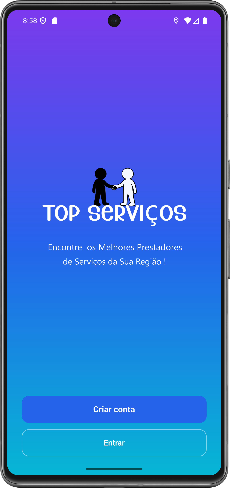
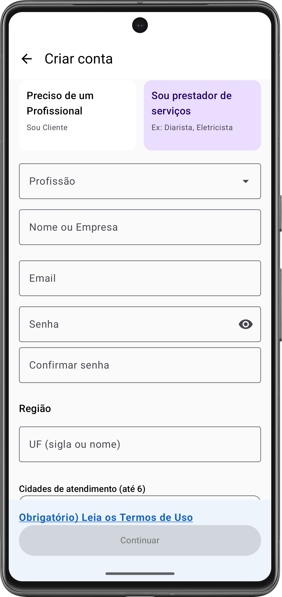
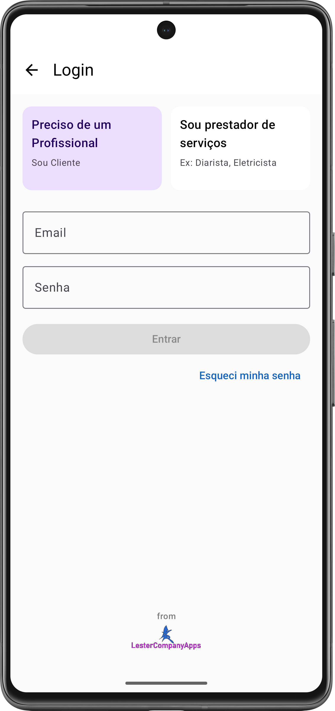
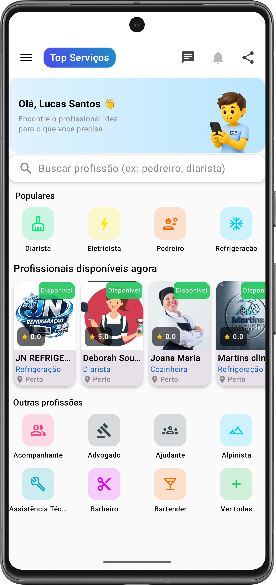
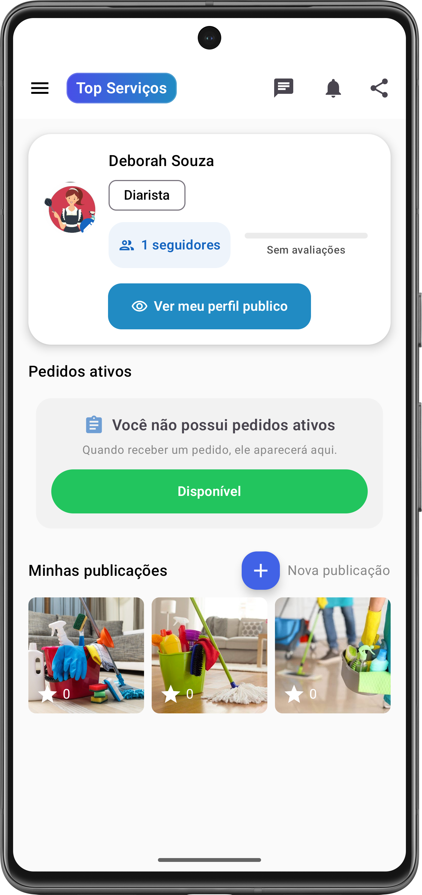
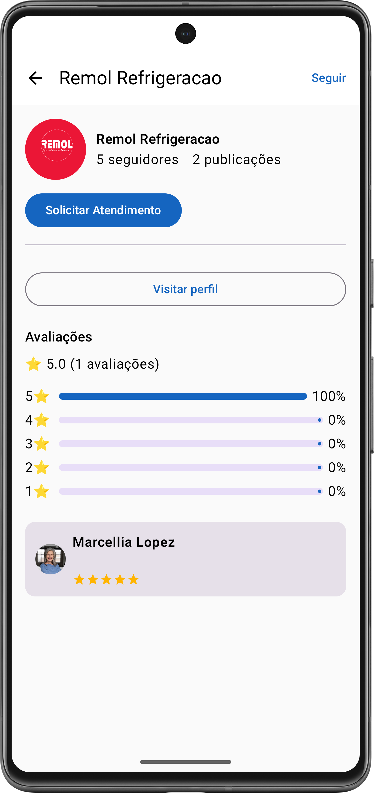
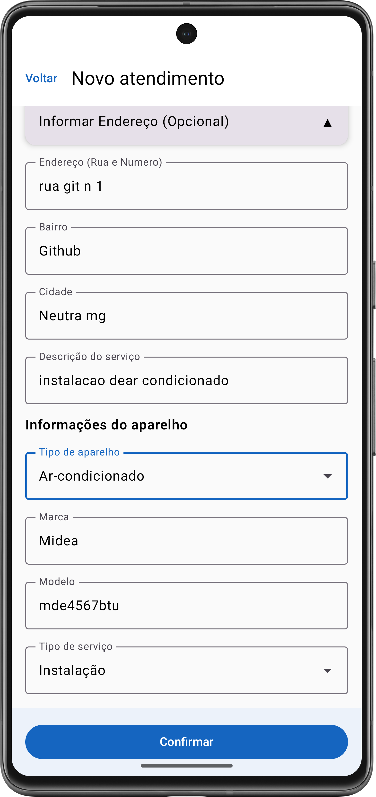

# Top Serviços

Aplicativo Android desenvolvido com Kotlin e Jetpack Compose para conectar clientes a profissionais de serviços.

---

## Sobre o projeto

O Top Serviços foi criado com o objetivo de facilitar a conexão entre clientes e profissionais de diversas áreas, oferecendo uma interface moderna, navegação intuitiva e integração com backend em tempo real.

Esta versão do projeto foi adaptada para fins de portfólio.

---

## Screenshots

  
  
  

  
  
  

  

---

## Tecnologias utilizadas

- Kotlin
- Jetpack Compose
- Retrofit
- Ktor
- Supabase
- Coroutines
- Material Design 3
- Navigation Compose

---

## Funcionalidades

- Cadastro e login de usuários
- Busca de profissionais
- Categorias de serviços
- Perfil profissional
- Integração com APIs REST
- Gerenciamento de estados
- Navegação moderna com Compose
- Tratamento de erros e validações

---

## Arquitetura

O projeto foi estruturado com separação de responsabilidades entre interface, consumo de APIs e gerenciamento de dados, buscando manter organização, legibilidade e facilidade de manutenção.

---

## Observação

Esta é uma versão simplificada do aplicativo original, publicada apenas para fins de portfólio e demonstração técnica.
